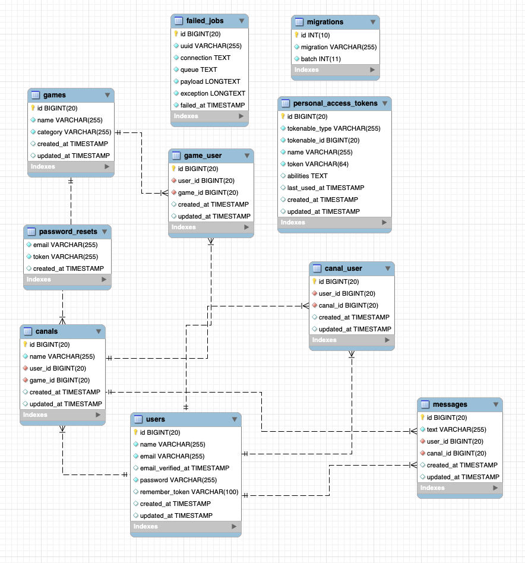

# Indice:

- [Chat Laravel](#Chat-Laravel)
- [Instrucciones](#instrucciones)
- [Endpoints](#endpoints)
    - [Auth](#auth)
    - [Canales](#canales)
    - [Message](#message)
- [EER Diagrama](#eer-diagrama)
  - [Autor](#autor)
      - [Ibrahim Alzuru :venezuela:](#Ibrahim-Alzuru)

# Chat Laravel

En este proyecto se emulan las propiedades de un chat tradicional, donde podras registrarte, crear un canal, enviar mensajes, borrar mensajes, etc.
El proyecto esta echo con Laravel.

# Instrucciones

Para poder lanzar peticiones necesitamos utilizar Postman (https://www.postman.com) y apuntar a este servidor de heroku: https://chat-php-ibra.herokuapp.com

# Endpoints

A continuación se especifican el método a introducir en Postman, y lo que debemos introducir a continuación de la raiz para acceder a cada uno de los endpoints.

### Auth

POST / register --> Puedes registrar un usuario

POST / login --> Puedes loguear el usuario

GET / profile  --> Puedes ver el perfil del usuario

PUT / profile/config/id --> Puedes modificar el perfil 

GET / logout --> Puedes hacer el logout del usuario

### Canales / Games

POST / createCanal/id    --> Puedes crear un canal

POST / addUserToCanal/id --> Puedes añadir un usuario al canal

GET / getCanals/id  --> Puedes ver un canal por su id

DELETE / deleteUserToCanal/id --> Puedes borrar el usuario del canal

POST / addUserToGame/id --> Añadir un usuario al juego

DELETE / deleteUserToGame/id --> Borrar un usuario del juego

### Message

POST / createMessage/id--> Puedes añadir un nuevo mensaje al canal

GET / seeMessage/id --> Puedes ver todos los mensajes de un canal

DELETE / deleteMessage/id --> Puedes borrar un mensaje

# EER Diagrama

## Autor

#### [Ibrahim Alzuru](https://github.com/ibralzuru) :venezuela:

---------------------

[:top:](#indice)